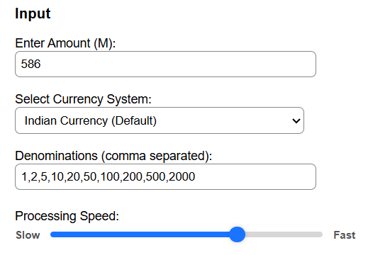
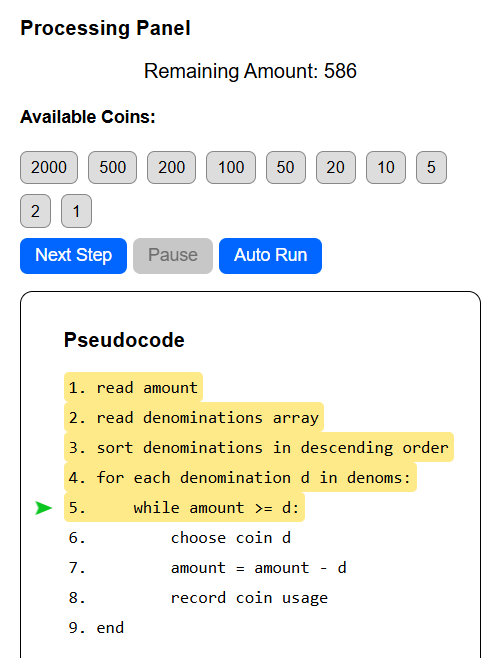
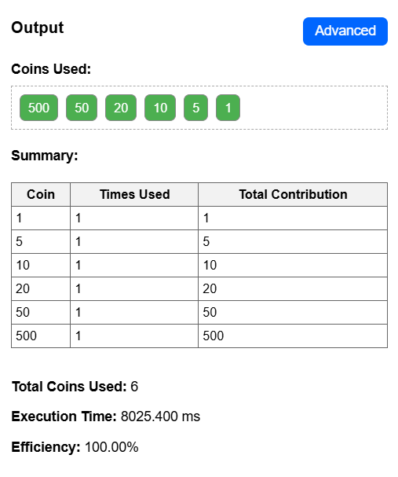
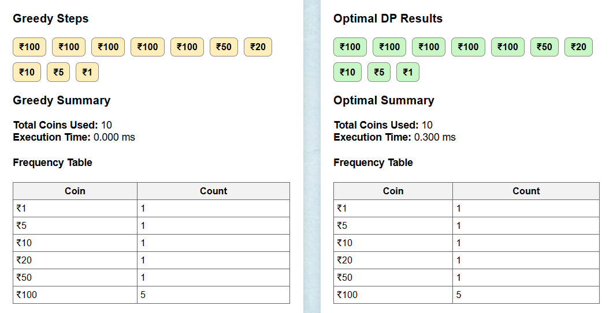
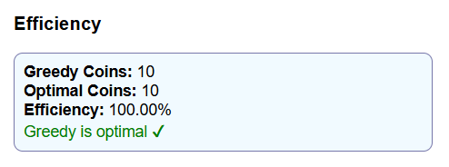

### Procedure

#### Step 1: User Input Configuration

1. Enter the required amount (M) in the input field provided.
2. Select the desired currency system from the available options.
3. Modify the coin denominations, if required, to create a custom currency system for experimentation.
4. Adjust the Processing Speed as per your need using the speed slider.

*Figure 1: Input panel showing amount entry, currency selection, denominations, and processing speed control.*

These steps help learners understand how different currency systems and denomination sets influence the behavior and outcome of the algorithm.

#### Step 2: Initialization of the Greedy Algorithm

1. Click on the Start Simulation button.

*Figure 2: Start Simulation button to start the simulation process.*

2. This action initializes the Greedy Coin Change Algorithm and prepares the simulation environment for execution.
3. The remaining amount, available coin denominations, and pseudocode display are reset and set to their initial states.

*Figure 3: Processing Panel showing the remaining amount, available coin denominations, and pseudocode display.*

#### Step 3: Selection of Execution Mode

Choose one of the following execution modes:

**(a) Manual Mode**

1. Click the Next Step button to execute the algorithm step-by-step.

*Figure 4: Next Step button to execute the next step in the simulation process.*

2. On each click:
* The largest coin denomination less than or equal to the remaining amount is selected.
* The remaining amount is updated accordingly.
* The selected coin is added to the “Coins Used” section.
* Simultaneously, the corresponding pseudocode lines are highlighted, and the arrow indicator moves to show the current execution step.
3. This mode is suitable for a detailed and conceptual understanding of each decision made by the greedy algorithm.

**(b) Automatic Mode**

1. Select the Auto-Run Mode to allow the algorithm to run continuously without user intervention.

*Figure 5: Auto-Run button to automatically run the simulation process.*

2. The complete execution is performed automatically:
* Coins are selected and updated sequentially.
* The remaining amount is updated at each step.
* The pseudocode is highlighted in parallel using the arrow pointer to indicate the execution flow.
3. The process continues until the required amount is fully formed.
4. This mode is suitable for quick observation of the complete algorithmic process.

#### Step 4: Step-wise Observation and Result Analysis

1. Observe how the greedy algorithm selects coins at each step.
2. Follow the highlighted pseudocode lines and arrow indicator, which represent the currently executing instruction.
3. Monitor changes in:
* Remaining amount
* Selected coin denominations
* Internal algorithm state
4. Analyze how locally optimal decisions are made at each step.

After completion of the process, a summary table is displayed in the output panel showing:
* Total number of coins used
* Execution time
* Efficiency of the greedy algorithm

This step helps visualize and analyze the working of the greedy strategy in detail.

*Figure 6: Output panel showing the Coins used, summary table, execution time and efficiency.*

#### Step 5: Transition to Advanced Analysis

1. After completing the greedy algorithm simulation, click on the Advanced button.

*Figure 7: Advanced button to proceed to the comparative simulation section.*

2. This opens the advanced analysis section designed for deeper evaluation and comparison.
3. Review the input parameters and configuration settings, as entered earlier, before proceeding.

#### Step 6: Comparative Simulation Execution

1. Click on Run Simulation in the Advanced section.

*Figure 8: Run Simulation button to execute the comparative simulation.*

2. The system executes:
* The Greedy Algorithm
* The Optimal Dynamic Programming Algorithm

*Figure 9: Comparative analysis between Greedy Algorihtm and Optimal Dynamic Programming Algorithm.*

3. Observe and compare the results based on:
* Number of coins used
* Selected coin combinations
* Execution time
* Overall efficiency

*Figure 10: Efficiency Analysis.*

#### Step 7: Result Interpretation

1. Compare the outputs of both approaches.
2. Identify scenarios where:
* The greedy algorithm produces an optimal solution.
* The greedy algorithm fails, and the dynamic programming approach provides a better solution.
3. Understand the practical limitations of greedy algorithms and the significance of optimal solutions obtained using dynamic programming.